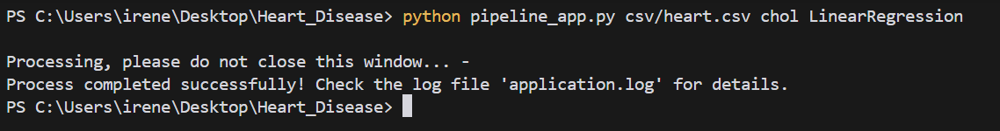
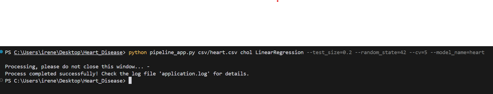
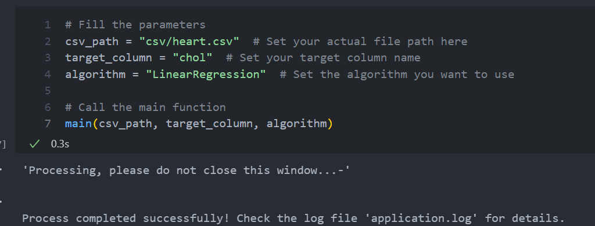
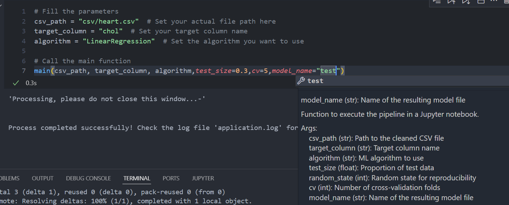

# Heart_Disease - Code Documentation

## Architecture

### `pipeline_app.py`

This Python script automates a machine learning pipeline for heart disease prediction. It takes user inputs such as a CSV file path, target column, and algorithm choice. The script trains the model, evaluates it using cross-validation, and saves the trained model to a file. A loading spinner is displayed during execution, and the process is logged for debugging. Error handling ensures that any issues are captured in a log file called `application.log`.

### `automl.py`

The `AutoML` class automates the process of training and evaluating machine learning models for both classification and regression tasks. It supports the following algorithms:

- Logistic Regression
- Random Forest Classifier and Regression
- Decision Trees Classifier and Regression
- Linear Regression.
  The class handles data loading, preprocessing (including outlier detection and imputation), model selection, hyperparameter tuning using GridSearchCV, and evaluation with cross-validation. The trained model is saved to a file, and detailed logging is provided throughout the process for tracking.

### `pipeline_notebook.ipynb`

This Python script automates the process of training a machine learning model using AutoML. It starts by configuring a logger to record important events and errors in an `application.log` file. The script features a loading spinner that runs in a separate thread, providing a visual indication that the model is being trained, while ensuring the main process remains responsive. The `main` function takes a CSV file, the target column, and the chosen algorithm as input, then initializes and trains the model using the AutoML class. The loading spinner is displayed throughout the training process, and once the model finishes training, the spinner stops, and a success message is shown. If an error occurs at any point, the spinner is stopped, and the error is logged as a critical issue. This structure allows the script to offer real-time feedback during execution and to log any issues for easier debugging.

### `notebook.ipynb`

This script loads a csv source file and performs data exploration through visualizations. It generates boxplots to identify potential outliers in numerical columns, using Seaborn and Matplotlib. It also creates a heatmap of the correlation matrix to show relationships between numerical features, with annotations for clarity. Additionally, it filters and prints out pairs of features with correlations above a specified threshold (e.g., 0.3 or -0.3) to highlight the strongest relationships in the dataset.

### `util.py`

This script provides utility functions for logging and input validation. The `get_logger` function configures and returns a logger, which writes logs to a file if specified. It ensures that multiple log handlers are not added. The `is_none_or_empty` function checks if a string is either None or empty, and the `check_mandatory_parameters` function validates that three required parameters—CSV path, target column, and algorithm—are provided and not empty. These utilities help in logging and ensuring necessary inputs are available for further processing.

### Diagram

```plaintext
+-------------------+       +-------------------+       +-------------------+   
|    Data Input     |       |  Data Preprocessing|       |   Model Selection |   
|  (CSV Loading)    |-----> | (Cleaning, Outliers|-----> | (Logistic, RF, etc)|
+-------------------+       |    Encoding)       |       +-------------------+   
                            +-------------------+             
                                      |                     
                                      v                     
                             +-------------------+       
                             |   Model Training  |       
                             | (Hyperparameter    |       
                             |   Tuning)          |       
                             +-------------------+       
                                      |                     
                                      v                     
                             +-------------------+       
                             |  Evaluation Layer  |       
                             | (Metrics, etc)|       
                             +-------------------+       
                                      |                     
                                      v                     
                             +-------------------+       
                             |    Output Layer   |       
                             |  (Log Results,    |       
                             |   Visualizations) |       
                             +-------------------+       

```

## Usage Instructions

### Requirements

To use this code, the following libraries must be installed using this command:
`pip install -r requirements.txt`

### Run the application from the Command Line

In order to use the application via command line, the following string must be written:

where it is specified:

- `python` the interpreter
- `pipeline_app.py` containing the main code that implements the data pipeline
- `csv/heart.csv` file path to the csx file
- `chol` name of the target column for prediction in dataset
- `LinearRegression` ML algorithm to use

It's possible to add optional args (preceded by `--`) that you can choose different from the defaults ones:

At the end of the procces two additional files will be available:

1. `.pkl` file containing the trained model
2. `application.log` containing the list of logs of the entire process performed, including the prediction values

### Use the application within a Jupyter Notebook
It is possible to benefit from the results of the application using a Jupiter notebook.
The user must select the 3 basic arguments for the programme, which are the csv path, the target column and the algorithm. 
Optional arguments can be defined directly in the main by separating the arguments with a comma.




## Developer Instructions
The files for the testing part are located in the test folder. Here's a brief description on ech file:
### `test_automl.py`
It contains test cases for the AutoML class. It includes several tests to verify the correct initialization of models, loading and preprocessing datasets, and checking for the target variable. The tests focus on checking if different machine learning algorithms (Logistic Regression, Random Forest, Decision Tree, Linear Regression) are correctly initialized based on the selected algorithm. It also verifies that the dataset is loaded correctly, contains the target variable, and that the preprocessing removes any missing values in the feature set.
### `test_utils.py`
This file contains test cases for utility functions used in the project. It tests three main functions:

1. `get_logger`: Verifies that a logger is created either with or without a log file.
2. `is_none_or_empty`: Checks if a given value is None, an empty string, or a string with only whitespace.
3. `check_mandatory_parameters`: Verifies that mandatory parameters (CSV path, target column, and algorithm) are not empty or None, raising appropriate errors when they are missing.

### How To Run Unit Tests 
Before running the tests, install all the libraries contained in the `requirements.txt` file, specifically `pytest`

Run the following command in the terminal from the project root:
```bash
pytest
```
To run specific test files:
```bash
pytest tests/test_automl.py
pytest tests/test_util.py
```

Note: if you want a verbose output, add -v flag to see detailed results.
```bash
pytest -v
```

### How to Interpret Test Results
Three outcomes are possible to visualize:

1. **PASSED**: The test passed successfully. This means the functionality is working as expected for the tested case.
2. **FAILED**: A failure indicates that the code does not behave as expected. The output will show:
    * The test name.
    * Assertion or exception that caused the failure.
    * The line number where the failure occurred.
3. **SKIPPED** *or* **XFAIL**: These are tests that are intentionally skipped or expected to fail. Check if these match the intended behavior.

### Common Troubleshooting Steps and Debugging Tips
After running pytest, in the error trace, the user can perform the following common troubleshooting steps:
1. Review Error Logs provided by pytest to identify the failing assertion or exception
2. Reproduce Locally, e.g. isolate the failing test by running it directly:


```bash
pytest tests/test_automl.py::test_initialize_model_logistic_regression
```

3. Verify Fixtures like `set_csv_file` or `automl_instance` are set up correctly

4. Validate Inputs, e.g check all parameters or files required by tests are correctly formatted.

5. Debugging Techniques
  * Enable Debugging: use IDE debugging tools.

  * Add Logs: Use print() or Python's logging module in the code or test for intermediate output:


      ```python
      print("Debug info:", variable)
      ```

