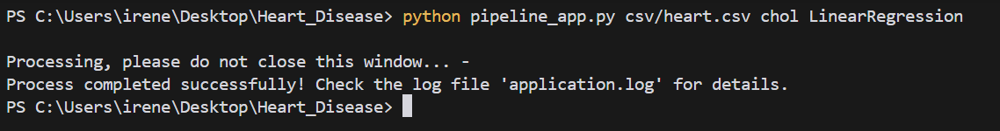
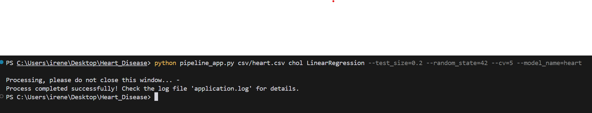

# Heart_Disease - Code Documentation

## Architecture

### `pipeline_app.py`

This Python script automates a machine learning pipeline for heart disease prediction. It takes user inputs such as a CSV file path, target column, and algorithm choice. The script trains the model, evaluates it using cross-validation, and saves the trained model to a file. A loading spinner is displayed during execution, and the process is logged for debugging. Error handling ensures that any issues are captured in a log file called `application.log`.

### `automl.py`

The `AutoML` class automates the process of training and evaluating machine learning models for both classification and regression tasks. It supports the following algorithms:

- Logistic Regression
- Random Forest Classifier and Regression
- Decision Trees Classifier and Regression
- Linear Regression.
  The class handles data loading, preprocessing (including outlier detection and imputation), model selection, hyperparameter tuning using GridSearchCV, and evaluation with cross-validation. The trained model is saved to a file, and detailed logging is provided throughout the process for tracking.

### `notebook.ipynb`

This script loads a csv source file and performs data exploration through visualizations. It generates boxplots to identify potential outliers in numerical columns, using Seaborn and Matplotlib. It also creates a heatmap of the correlation matrix to show relationships between numerical features, with annotations for clarity. Additionally, it filters and prints out pairs of features with correlations above a specified threshold (e.g., 0.3 or -0.3) to highlight the strongest relationships in the dataset.

### `util.py`

This script provides utility functions for logging and input validation. The `get_logger` function configures and returns a logger, which writes logs to a file if specified. It ensures that multiple log handlers are not added. The `is_none_or_empty` function checks if a string is either None or empty, and the `check_mandatory_parameters` function validates that three required parameters—CSV path, target column, and algorithm—are provided and not empty. These utilities help in logging and ensuring necessary inputs are available for further processing.

### Diagram

```diff
+-------------------+
|    Data Input     |
|  (CSV Loading)    |
+-------------------+
         |
         v
+-------------------+
|  Data Preprocessing|
|   (Cleaning, Outliers, Encoding)|
+-------------------+
         |
         v
+-------------------+
| Model Selection   |
|  (Logistic, RF, etc)|
+-------------------+
         |
         v
+-------------------+
| Model Training    |
| (Hyperparameter Tuning) |
+-------------------+
         |
         v
+-------------------+
| Evaluation Layer  |
|  (Metrics Calculation)|
+-------------------+
         |
         v
+-------------------+
|    Output Layer   |
|  (Log Results, Visualizations) |
+-------------------+
```

## Usage Instructions

### Requirements

To use this code, the following libraries must be installed using this command:
`pip install -r requirements.txt`

### Run the application from the Command Line

In order to use the application via command line, the following string must be written:

where it is specified:

- `python` the interpreter
- `pipeline_app.py` containing the main code that implements the data pipeline
- `csv/heart.csv` file path to the csx file
- `chol` name of the target column for prediction in dataset
- `LinearRegression` ML algorithm to use

It's possible to add optional args (preceded by `--`) that you can choose different from the defaults ones:

At the end of the procces two additional files will be available:

1. `.pkl` file containing the trained model
2. `application.log` containing the list of logs of the entire process performed, including the prediction values

### Use the application within a Jupyter Notebook
